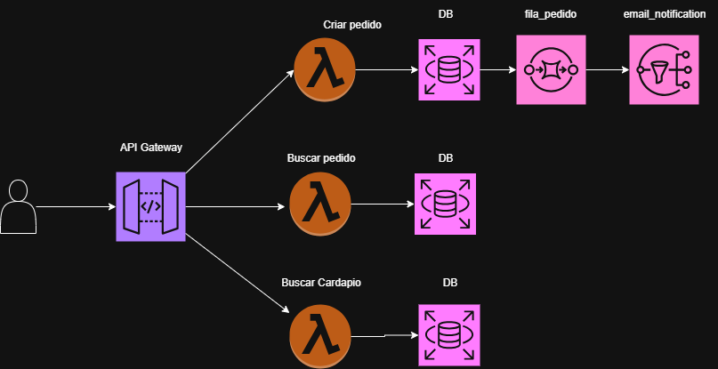

#  Sistema de Vendas de Brigadeiro Gourmet

Este projeto simula um sistema de **vendas de brigadeiro gourmet**, desenvolvido com [Python](https://www.python.org/), utilizando **estruturas de dados em fila (queue)** para organizar pedidos e manter o fluxo de vendas eficiente.  
Além disso, foram utilizadas **rotas de API REST** e **notificações via SNS** para simular a comunicação com clientes.

---

##  Arquitetura do Projeto

-  **Python** → linguagem base do projeto  
-  **Queue** → estrutura de dados para organizar pedidos  
-  **API REST** → rotas POST, GET e DELETE para gerenciar pedidos  
-  **SNS** → simulação de envio de notificações por e-mail para clientes

---

## Funcionalidades 
### Cardápio
- Exibe os sabores disponíveis de brigadeiro gourmet, permitindo que o cliente escolha o que deseja pedir.

### Fazer Pedido (POST)
- Adiciona um novo pedido na fila de atendimento.

### Buscar Pedido (GET)
- Lista os pedidos em aberto, mostrando a ordem de atendimento.

### Notificações (SNS)
- Simula o envio de e-mails para informar:
  - Confirmação de pedido

## Encerramento

Esse foi o nosso projeto de sistema de vendas de brigadeiro gourmet.
É um exemplo simples, mas que mostra como a programação pode ajudar em negócios reais.

### Autores

Cárita Dias Martins
Gabriel Ronan